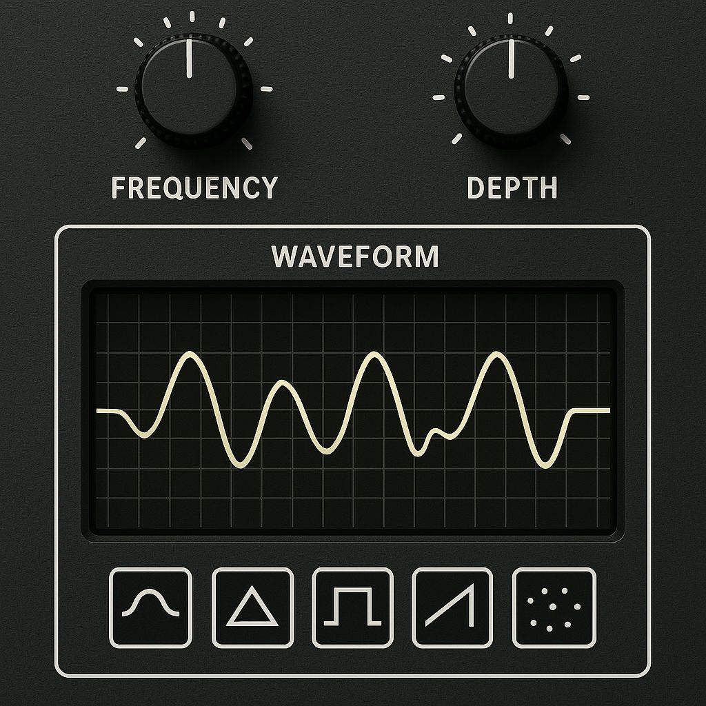

# LFO for Pure Data (audio rate)

Multiple shapes and shape manipulation. The LFO provides an outlet that outputs a bang when reset (or passes 0).

Binaries for x64/ARM Linux can be found in folder bin.